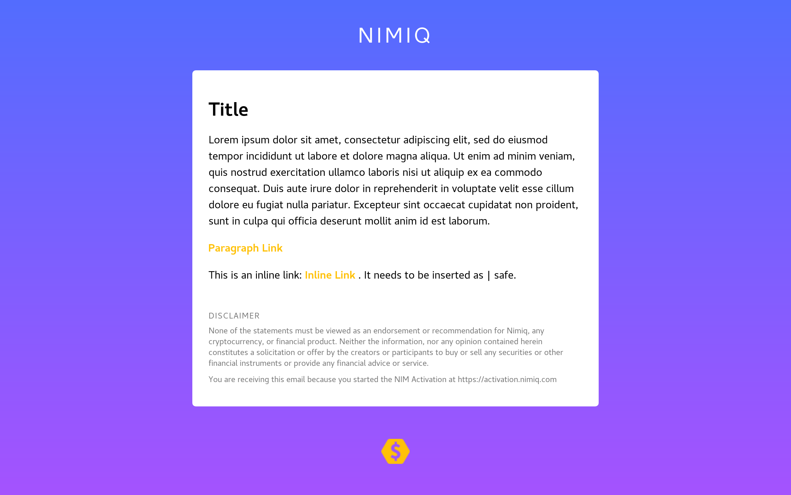

# Nimiq Email Template and Email Generator




This repository provides a default template that can be compiled to html emails in the Nimiq style. The build process is based on [gulp-email-workflow](https://github.com/ireade/gulp-email-workflow) by Ire Aderinokun.
New emails can be either generated by the template engine of this repository or by using a prebuilt MailChimp compatible template. 


## Using MailChimp

This repository includes an email template enriched with [MailChimp Templating Tags](https://templates.mailchimp.com/getting-started/template-language/) and [Merge Tags](https://templates.mailchimp.com/getting-started/merge-tags/basic-merge-tags/). To use it with MailChimp, just copy the prebuilt `mailchimp.html` to MailChimp as a new template. No additional setup is required.


## Using the Template Engine


### Install dependencies

```
npm install
```


### Building

```
gulp
```

The compiled emails will be in the `build/` directory.


### Template Engine

[Nunjucks](https://mozilla.github.io/nunjucks/) is used for compiling template files to HTML.

Templates are stored in `src/templates/` and partials in `src/templates/partials`. To create a template, create a file in the templates directory with the `.nunjucks` file extension. 

See https://mozilla.github.io/nunjucks/templating.html for the whole Nunjucks templating documentation. Here are some options of particular interest (please remove the space between the curly brackets and percentage sign when using):


```
{ % include "partials/PARTIAL_FILE_NAME.nunjucks" % }
```
Includes a partial into the mail.

```
{ % extends "main.nunjucks" % }
```
Creates a template based on a parent template. 

```
{ % block CUSTOM_BLOCK_NAME % }{ % endblock % }
```
Defines a block of dynamic content to be replaced. To specify the content of a block, the child template can define the same block with the specific content.

```
{ % macro macroName(param1, param2='', ...) % }{ % endmacro % }
```
Defines a macro that generates content which can be used as `{{ macroName(param1, param2, ..) }}`.


### Default Template

#### Main Layout

The main layout and design is defined in `/templates/main.nunjucks`.
It provides the following hooks for your content:

```
{ % block CONTENT % }{ % endblock % }
```
For the main content of your email.

```
{ % block SUBSCRIPTION_INFO % }{ % endblock % }
```
For providing the recipient with information why he is receiving the email and how he can unsubscribe.

```
{ % block FOOTER % }{ % endblock % }
```
A footer on the very bottom on the email. For example for providing a copyright notice.

#### Predefined Macros

Useful macros are predefined in `/templates/partials/macros.nunjucks`:

```
{{ title(content, containerAttributes='') }}
```
To create a heading.

```
{{ paragraph(content, containerAttributes='', contentAttributes='') }}
```
To create a plain text paragraph.

```
{{ paragraphLink(content, href, containerAttributes='', contentAttributes='') }}
```
To create a paragraph consisting of a link.

```
{{ inlineLink(content, href) }}
```
To insert an inline link within a paragraph that can go along other plain text.

If you want to to use a html string as input to a macro, append a `| safe` to the argument.


### Creating New Emails Based on the Default Template

To create an email based on the default template, create a new file in the `src/emails/` directory with the `.nunjucks` file extension.

Inherit from the the main template by using the following syntax -

```
{ % extends "main.nunjucks" % }
```

Import the predefined macros by -
```
{ % from "../templates/partials/macros.nunjucks" import paragraph, title, paragraphLink, inlineLink % }
```

Now you're ready to define the content of your email. To see how everything plays together, have a look at `/emails/example-mail.nunjucks`.


### Creating Your Own Templates or Changing the Default Template

As there is a myriad of different mail clients out there and many are based on outdated or restricted rendering engines, special rules need to be followed when creating email templates. 

The following links are a good starting point:

- [Build an HTML Email Template From Scratch](https://webdesign.tutsplus.com/articles/build-an-html-email-template-from-scratch--webdesign-12770)
- [MailChimp Email Design Reference](https://templates.mailchimp.com/)

Some key points to take away are:

- Your Layout should have a fixed width of 600px to fit all mail clients.
- Do all the layouting with HTML tables
- Provide fallbacks for css. Whenever there is a native tag (like `<b>` or `<center>`) or attribute (like `bgcolor` or `width`) use that one in combination with your css.
- Don't use `<style>` tags or import style from external css files, instead inline all the styles on the elements.
- `<td>`s are the safest elements to apply your style. Try to wrap all your content into `<td>` tags and apply the styles on them.
- Even `<div>` and `<h1>` etc. are not consistently supported. Use `<td>`s instead.
- Prefer the use of padding over the use of margins. Always provide all values in the form of `padding: top right bottom left;`
- Avoid compound properties, instead declare properties separately (e.g. `font-family` and `font-size` instead of `font`)
- For mobile clients provide a responsive layout using media queries in a `<style>` tag which are safe to use on mobile clients as they usually support `<style>` tags and media queries. Overwrite the inline style rules using `!important`
- Run your HTML markup through the HTML validator and avoid invalid HTML if possible.
- Use tools like EmailOnAcid or Litmus or MailChimp Inbox Preview.